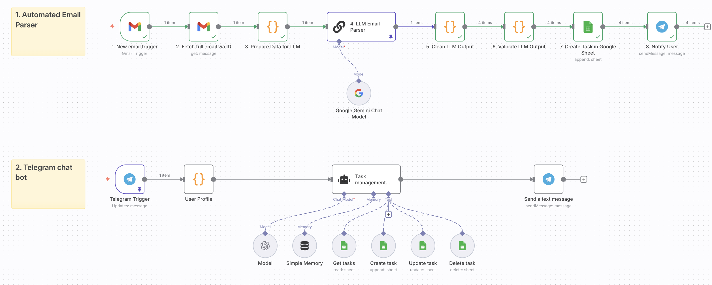

# AI Task Agent

> A task assistant built with n8n that captures tasks from emails and provides a chatbot with a prioritised to-do list via Telegram.

*A brief demo showing the agent creating a task from an email and responding to a query in Telegram.*

---

## About The Project

The system has two core functions:
1.  **Automated Email Parser:** It actively monitors my Gmail, uses an LLM (Gemini flash 2.5) to identify actionable tasks, and automatically adds them to my central task list in Google Sheets.
2.  **Interactive Telegram Bot:** It provides a conversational interface (powered by GPT-4o) for me to manage my tasks (CRUD). Importantly, it provides the todo list in sorted priority based on a formula that weighs both importance and urgency.

---

## Tech Stack

*   **Automation Platform:** [n8n](https://n8n.io/)
*   **AI / Language Models:** OpenAI (GPT-4o), Google Gemini
*   **Integrations:**
    *   Telegram API
    *   Gmail API
    *   Google Sheets API

---

## Setup & Installation

1.  **Clone the repository**
2.  **Import Workflow:** Import the `workflow.json` file into your n8n instance.
3.  **Configure Credentials:** Set up API credentials in n8n for your LLM model, Google (for Gmail & Sheets), and your Telegram Bot.
4.  **Set up Google Sheet:** Create a Google Sheet with the required columns (`Task`, `Description`, `Deadline`, `Importance`, `Work Total`, `Priority Score`, etc.).
5.  **Activate Workflows:** Turn on both workflows in the n8n dashboard.